<div align="center">

  <picture>
    <source media="(prefers-color-scheme: dark)" srcset="./dark.svg">
    <source media="(prefers-color-scheme: light)" srcset="./light.svg">
    
  </picture>

  <br/>
  <br/>

  [](https://www.steelandstack.com)
  [](https://www.steelcircuits.com)
  [](https://github.com/devansh8011-oss)
  [](https://instagram.com/devansh999ai)
  [](mailto:devansh8011@gmail.com)
  

</div>

---

### ⚡ Executive Summary

> *"Engineering the future of tech."*

I am **Devansh Grover**, Founder at **[Steel and Stack](https://www.steelandstack.com)** (`steelandstack.com`), student at **DPS Indirapuram (Delhi)**, and a systems builder with 4+ years of hands-on experience bridging high-level web architecture, autonomous robotics hardware, and generative AI systems.

- 🏢 **Startup**: **[Steel and Stack](https://www.steelandstack.com)** — Building next-generation digital products, AI automation pipelines, and engineering infrastructure.
- 🚀 **Currently Building**: Scalable web platforms, autonomous robotics controllers, and intelligent workflow automation systems.
- 🛠️ **Core Specialties**: Full-Stack Development (React 19 / Node.js), Embedded C++ & ROS, Cloud Infrastructure, and AI-driven client solutions.
- 📍 **Base**: Delhi, India.

---

### 🛸 Featured Engineering & Ventures

<table>
  <tr>
    <td width="50%" valign="top">
      <h3 align="center">🏢 Steel and Stack</h3>
      <p align="center"><b>Flagship Startup &amp; Engineering Lab</b></p>
      <p>Tech innovation studio and development firm engineering end-to-end web architecture, customized automation workflows, and specialized technical systems.</p>
      <p align="center">
        <a href="https://www.steelandstack.com"><b>Visit steelandstack.com »</b></a>
      </p>
    </td>
    <td width="50%" valign="top">
      <h3 align="center">⚡ SteelCircuits</h3>
      <p align="center"><b>Personal Engineering Hub &amp; Portfolio</b></p>
      <p>High-performance personal engineering hub and systems showcase built natively with <b>React 19</b>, modern component architecture, and responsive glassmorphism interfaces.</p>
      <p align="center">
        <a href="https://www.steelcircuits.com"><b>Visit steelcircuits.com »</b></a>
      </p>
    </td>
  </tr>
  <tr>
    <td width="50%" valign="top">
      <h3 align="center">🎓 Dream College</h3>
      <p align="center"><b>AI Academic &amp; Counseling Platform</b></p>
      <p>AI-driven counseling platform that equips students with personalized guidance, college trajectory roadmaps, and intelligent student pathway discovery tools.</p>
      <p align="center">
        <a href="https://www.dreamcollege.co.in"><b>Visit dreamcollege.co.in »</b></a>
      </p>
    </td>
    <td width="50%" valign="top">
      <h3 align="center">🍰 CocoaDotts</h3>
      <p align="center"><b>Artisan Bakery Commerce Engine</b></p>
      <p>Custom digital ordering platform and business infrastructure built for a bespoke confectionery and artisan bakery, handling real-time custom cake workflows and sales.</p>
      <p align="center">
        <a href="https://www.cocoadotts.com"><b>Visit cocoadotts.com »</b></a>
      </p>
    </td>
  </tr>
</table>

---

### 💻 Technical Arsenal

```ini
[CORE_LANGUAGES]       = C++ · Python · JavaScript · TypeScript · HTML5 · CSS3
[FRONTEND_FRAMEWORKS]  = React 19 · Next.js · Tailwind CSS
[BACKEND_RUNTIMES]     = Node.js · Express.js · REST APIs
[ROBOTICS_EMBEDDED]    = ROS (Robot Operating System) · Arduino · ESP32 · Raspberry Pi · KiCad PCB
[COMPUTER_VISION]      = OpenCV · MediaPipe · Real-time Sensor Interfacing
[CLOUD_DATABASES]      = Firebase · Supabase · Google Cloud Platform (GCP) · AWS · Azure
[COMMERCE_AUTOMATION]  = Razorpay Gateway · n8n Automation Engine · Webhooks
[ENGINEERING_TOOLS]    = VS Code · Cursor · Claude Code · Antigravity · ChatGPT · Git · GitHub
```

---

### 📊 Telemetry & GitHub Activity

<div align="center">
  
  
</div>

---

### 📡 Terminal Dispatch & Connect

```bash
devansh@steelstack:~$ curl -s https://www.steelandstack.com/connect
```

- 🏢 **Startup / Venture**: [steelandstack.com](https://www.steelandstack.com)
- 🌐 **Portfolio**: [steelcircuits.com](https://www.steelcircuits.com)
- 🐙 **GitHub**: [@devansh8011-oss](https://github.com/devansh8011-oss)
- 📸 **Instagram**: [@devansh999ai](https://instagram.com/devansh999ai)
- 📧 **Direct Email**: [devansh8011@gmail.com](mailto:devansh8011@gmail.com)
- 🏫 **School**: DPS Indirapuram, Delhi

<div align="center">
  <sub>Designed with precision terminal architecture · Powered by Antigravity</sub>
</div>
